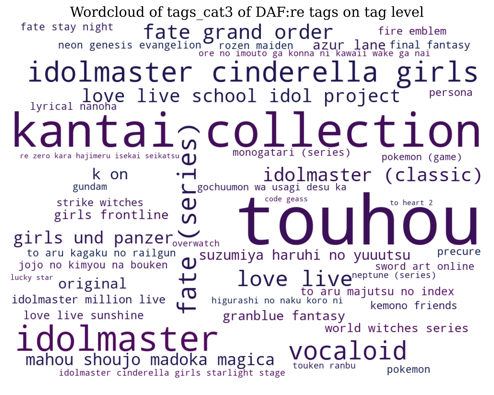
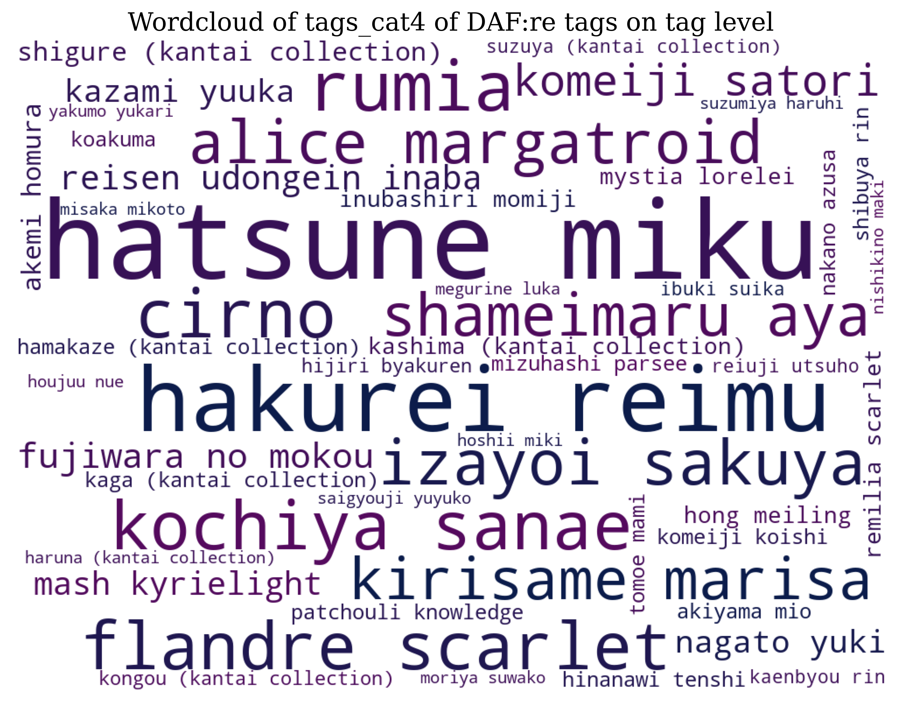

# DanbooruAnimeFaces:revamped Summary

Process to obtain the dataset and tags:


Download from the following [Google Drive folder](https://drive.google.com/drive/folders/1S_T8R7gbY47dfRH9dUBXOstlOwVuMmXe?usp=sharing).
From `data` folder in Google Drive download `dafre_faces.tar.gz` for *DAF:re Faces* or `dafre_full.tar.gz` for *DAF:re Full*, and `labels.tar.gz` and uncompress their contents into desired data storage location (suggest to clone this [DAF:re repo](https://github.com/arkel23/Danbooru2018AnimeCharacterRecognitionDataset_Revamped) and uncompress these folders) so that both `faces` and/or `fullMin256` directories, along with `labels` are at the same level.

We have two splits, one for face-crops only, and one for full-body images, named as  *DAF:re Faces* and *DAF:re Full*, respectively. Samples from the training set for both versions can be seen below:


Histogram of classes with most samples. It's clear that the distribution is very long-tailed.


Wordcloud of category 0 (description) tags at word-level along with most popular tags:


Wordcloud of category 3 (series or source material) and category 4 (characters):



This repo provides substantial changes to the dataset provided by 
[grapeot](https://github.com/grapeot/Danbooru2018AnimeCharacterRecognitionDataset).
Scripts provided to make the new dataset are included in the `support` directories, and process the data as described in the above diagram:
* `support/dafre_create_prepare/make_data_dic_danbooru.py` reads the original faces.tsv file and extracts directories and IDs with prediction confidence above 85% as previously done. 
Then only the IDs and addresses are kept.
* `support/dafre_create_prepare/data_split_danbooru.py` reads the resulting danbooru2018_faces_85.csv file from the previous script and generates train, val and test.csv files corresponding to
0.7, 0.1 and 0.2 ratios of the total number of images.
Additionally, this script only keeps the classes with at least 10 examples in the dataset.
This makes the dataset keep its use for testing for long-tailed and few-shot classification and detection tasks
But at the same time reducing the overall complexity of the set.
* `support/download_resize` scripts support download and creation of the resized to 256 short side versions of the original full resolution images (without the white or black padding used in the 512x512px originally provided).
* `support/tags_prepare` include supporting scripts to prepare the tags from the original Danbooru2018 metadata, and filter according to the above steps. 
* `visualization_stats` include functions to make histograms, wordclouds and display stats above the different tag categories for the dataset, by taking in a `dafre*.csv` file. It also includes functions to display the dataset pictures or search by tags.

Below has been mostly unchanged (added our reference).

# Danbooru 2018 Anime Character Recognition Dataset

This repo provides an anime character recognition dataset based on [Danbooru 2018](https://www.gwern.net/Danbooru2018).
The original Danbooru dataset provides images with tags.
We processed the dataset (more details below) to generate 1M head images with corresponding character tags.
About 70k characters are included in the dataset.
<!-- The dataset can be used to train/evaluate anime character recognition algorithms, and provide Amazon X-Ray like experience (shown below). -->

## Methodology

We processed the original Danbooru dataset as follows:

* First only the character tags were kept by filtering according to the category of the tag.
* Because we don't have information on which face corresponds to which tag, we only kept the images that have only one character tag.
* Then we extracted head bounding boxes using [this model](https://github.com/grapeot/AnimeHeadDetector).
* For similar reasons, we discarded the images on which multiple head boxes are detected.

This ended up with 0.97M images and 70k tags. 

### Data Distribution and Visualization

Out of these 1M images, the distribution of how many images each tag has is visualized as below:


Only the 100 tags with the most images are shown here for clarify.
And the top-20 tags are:

* hatsune_miku
* hakurei_reimu
* flandre_scarlet
* kirisame_marisa
* cirno
* izayoi_sakuya
* remilia_scarlet
* kochiya_sanae
* rumia
* shameimaru_aya
* patchouli_knowledge
* inubashiri_momiji
* fujiwara_no_mokou
* komeiji_koishi
* reisen_udongein_inaba
* yakumo_yukari
* alice_margatroid
* komeiji_satori
* hinanawi_tenshi
* kazami_yuuka

It is obvious that the distribution is long-tail, considering the average number of images per tag is 13.85.
I'm also surprised to see how popular Touhou Project is in the Danbooru dataset.
Out of the 70k tags, about 20k tags only have one single image. 
While they may not be very useful in character recognition, we still keep them in the dataset. 

Here is a visualization of some top tags.


## How to Use

The core of the database is the detected head bounding boxes and corresponding tags.
This is stored in the file `faces.tsv`.
Note you will have to obtain the images from the [original Danbooru dataset](https://www.gwern.net/Danbooru2018)
The tsv file has three columns.
The first column is the file name from the Danbooru dataset.
The second column is the tag id, and the third column is the head detection results.
Each detection result has five fields separated by commas, i.e. left, top, right, bottom, confidence in order.
The tag text for each id can be seen in the file `tagIds.tsv`.

We also have the cropped face images ready as a tarball.
Many thanks to [gwern](https://github.com/gwern), you can now download the tarball using `rsync`:

```bash
rsync --verbose rsync://78.46.86.149:873/biggan/2019-07-27-grapeot-danbooru2018-animecharacterrecognition.tar ./
```

# References
If you find this work useful, please consider citing:

* E. A. Rios, W.-H. Cheng, and B.-C. Lai, “DAF:re: A Challenging, Crowd-Sourced, Large-Scale, Long-Tailed Dataset For Anime Character Recognition,” arXiv:2101.08674 [cs], Jan. 2021, Accessed: Jan. 22, 2021. [Online]. Available: http://arxiv.org/abs/2101.08674.
* Yan Wang, "Danbooru2018 Anime Character Recognition Dataset," July 2019. https://github.com/grapeot/Danbooru2018AnimeCharacterRecognitionDataset 
* Anonymous, The Danbooru Community, & Gwern Branwen; “Danbooru2020: A Large-Scale Crowdsourced and Tagged Anime Illustration Dataset”, 2020-01-12. Web. Accessed [DATE] https://www.gwern.net/Danbooru2020


```bibtex
@misc{rios2021dafre,
      title={DAF:re: A Challenging, Crowd-Sourced, Large-Scale, Long-Tailed Dataset For Anime Character Recognition}, 
      author={Edwin Arkel Rios and Wen-Huang Cheng and Bo-Cheng Lai},
      year={2021},
      eprint={2101.08674},
      archivePrefix={arXiv},
      primaryClass={cs.CV}
}
```

```bibtex
    @misc{danboorucharacter,
        author = {Yan Wang},
        title = {Danbooru 2018 Anime Character Recognition Dataset},
        howpublished = {\url{https://github.com/grapeot/Danbooru2018AnimeCharacterRecognitionDataset}},
        url = {https://github.com/grapeot/Danbooru2018AnimeCharacterRecognitionDataset},
        type = {dataset},
        year = {2019},
        month = {July} }
```

```bibtex
    @misc{danbooru2020,
        author = {Anonymous and Danbooru community and Gwern Branwen},
        title = {Danbooru2020: A Large-Scale Crowdsourced and Tagged Anime Illustration Dataset},
        howpublished = {\url{https://www.gwern.net/Danbooru2020}},
        url = {https://www.gwern.net/Danbooru2020},
        type = {dataset},
        year = {2021},
        month = {January},
        timestamp = {2020-01-12},
        note = {Accessed: DATE} }
```


## Character Recognition Baseline

We also provide a baseline for character recognition based on the dataset.
If using a ResNet18 without SE, and use the ArcFace loss, we are able to achieve a testing accuracy of 37.3%.
The model and a related demo will be released soon.

### Data Split

The split for the baseline is also provided in case evaluation and comparison of the algorithms are of interest.

* `trainSplit.tsv` contains the image ids for training.
* `valSplit.tsv` contains the image ids for validation.
* `testSplit.tsv` is the set we use to measure the final accuracy.

The total number of images are less than the entire dataset because we removed images that did not reach the confidence bar (0.85).
Note at the current stage the test set has not been verified by humans.

## Open problems

* The test set for character recognition is to be verified by humans.
* Still need to do more work on face alignment.
